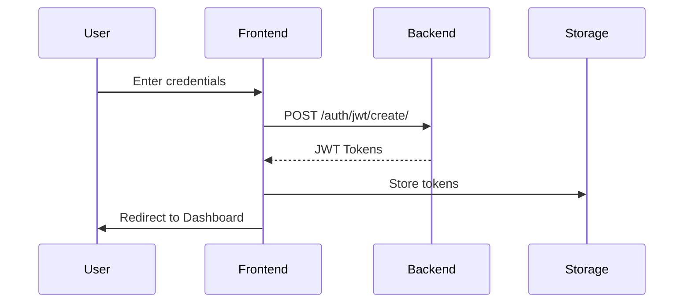

# Job Portal Frontend

A modern, responsive single-page application (SPA) built with React and Redux for a comprehensive job portal platform. This frontend demonstrates advanced React development skills including state management, component architecture, form handling, and modern UI/UX practices.

## 🏗️ Architecture Overview

### Frontend Architecture

```
┌────────────────────────────────────────────────────────────────────────┐
│                          PRESENTATION LAYER                            │
├────────────────────────────────────────────────────────────────────────┤
│                                                                        │
│    ┌──────────────┐                                                    │
│    │ Web Browser  │                                                    │
│    └──────┬───────┘                                                    │
│           │                                                            │
│           ▼                                                            │
│    ┌──────────────┐                                                    │
│    │React Router  │                                                    │
│    └──────┬───────┘                                                    │
│           │                                                            │
│           ▼                                                            │
│    ┌──────────────┐                                                    │
│    │Layout        │                                                    │
│    │Components    │                                                    │
│    └──────┬───────┘                                                    │
│           │                                                            │
└───────────┼────────────────────────────────────────────────────────────┘
            │
            ▼         
┌────────────────────────────────────────────────────────────────────────┐
│                          COMPONENT LAYER                               │
├────────────────────────────────────────────────────────────────────────┤
│                                                                        │
│  ┌──────────────┐  ┌──────────────┐  ┌───────────────┐                 │
│  │ Screen       │  │ Reusable     │  │ Form          │                 │
│  │ Components   │  │ Components   │  │ Components    │                 │
│  └──────┬───────┘  └──────┬───────┘  └───────┬───────┘                 │
│         │                 │                  │                         │
│         │                 │                  │                         │
│  ┌──────┴─────────────────┴──────────────────┴─────────┐               │
│  │              Modal Components                       │               │
│  └──────────────────────┬──────────────────────────────┘               │
│                         │                                              │
└─────────────────────────┼──────────────────────────────────────────────┘
                          │
                          ▼
┌────────────────────────────────────────────────────────────────────────┐
│                    STATE MANAGEMENT LAYER                              │
├────────────────────────────────────────────────────────────────────────┤
│                                                                        │
│    ┌───────────────────────────────────────────────────────┐           │
│    │              Redux Store                              │           │
│    │                                                       │           │
│    │  ┌──────────────┐  ┌───────────────┐                  │           │
│    │  │ Action       │  │ Reducers      │                  │           │
│    │  │ Creators     │  │               │                  │           │
│    │  └──────┬───────┘  └──────┬────────┘                  │           │
│    │         │                 │                           │           │
│    │         └─────────┬───────┘                           │           │
│    │                   │                                   │           │
│    │         ┌─────────▼────────┐                          │           │
│    │         │ Redux Thunk      │                          │           │
│    │         │ Middleware       │                          │           │
│    │         └──────────────────┘                          │           │
│    └──────────────┬────────────────────────────────────────┘           │
│                   │                                                    │
└───────────────────┼────────────────────────────────────────────────────┘
                    │
                    ▼
┌────────────────────────────────────────────────────────────────────────┐
│                            SERVICE LAYER                               │
├────────────────────────────────────────────────────────────────────────┤
│                                                                        │
│  ┌──────────────┐  ┌───────────────┐  ┌───────────────┐                │
│  │ Axios HTTP   │  │ Auth          │  │ Alert         │                │
│  │ Client       │  │ Service       │  │ Service       │                │
│  └──────┬───────┘  └───────────────┘  └───────────────┘                │
│         │                                                              │
└─────────┼──────────────────────────────────────────────────────────────┘
          │
          ▼
┌────────────────────────────────────────────────────────────────────────┐
│                           BACKEND API                                  │
├────────────────────────────────────────────────────────────────────────┤
│                                                                        │
│              ┌───────────────────────────┐                             │
│              │  Django REST API          │                             │
│              └───────────────────────────┘                             │
│                                                                        │
└────────────────────────────────────────────────────────────────────────┘
```

## 🚀 Tech Stack

### Core Framework
- **React 17.0.1** - JavaScript library for building user interfaces
- **React DOM 17.0.1** - React renderer for web
- **React Router DOM 5.2.0** - Declarative routing for React

### State Management
- **Redux 4.0.5** - Predictable state container
- **React Redux 7.2.2** - Official React bindings for Redux
- **Redux Thunk 2.3.0** - Middleware for async actions
- **Redux DevTools Extension** - Development tools

### UI Libraries
- **React Bootstrap 1.4.3** - Bootstrap components for React
- **Bootstrap 4.6.0** - CSS framework
- **React Icons 4.2.0** - Popular icons library
- **React Pro Sidebar 0.6.0** - Professional sidebar component

### Form Management
- **React Hook Form 6.15.1** - Performant form library
- **React Hooks Helper 1.6.0** - Utility hooks

### HTTP Client
- **Axios 0.21.1** - Promise-based HTTP client

### Additional Libraries
- **React Helmet 6.1.0** - Document head management (SEO)
- **React CKEditor Component 1.1.0** - Rich text editor
- **UUID 8.3.2** - Unique identifier generation
- **Web Vitals 1.1.0** - Web performance metrics

### Build Tools
- **React Scripts 4.0.2** - Create React App build configuration
- **ESLint** - Code linting
- **Babel** - JavaScript compiler

## 📁 Project Structure

```
frontend/
├── public/                  # Static public files
│   ├── index.html          # HTML template
│   ├── favicon.ico         # Site icon
│   └── manifest.json       # PWA manifest
│
├── src/
│   ├── actions/            # Redux action creators
│   │   ├── alert.js        # Alert actions
│   │   ├── assessments.js  # Assessment actions
│   │   ├── auth.js          # Authentication actions
│   │   ├── job.js           # Job actions
│   │   ├── profile.js       # Profile actions
│   │   └── types.js         # Action type constants
│   │
│   ├── components/         # Reusable components
│   │   ├── accounts/       # Account-related components
│   │   │   ├── forms/      # Form components
│   │   │   ├── modals/     # Modal components
│   │   │   ├── profile_sections/  # Profile section components
│   │   │   └── styles/     # Component styles
│   │   ├── auth/           # Authentication components
│   │   ├── jobs/           # Job-related components
│   │   └── layout/         # Layout components (Header, Footer, etc.)
│   │
│   ├── reducers/           # Redux reducers
│   │   ├── alert.js        # Alert reducer
│   │   ├── assessments.js  # Assessment reducer
│   │   ├── auth.js          # Auth reducer
│   │   ├── job.js           # Job reducer
│   │   ├── profile.js       # Profile reducer
│   │   └── index.js         # Root reducer
│   │
│   ├── screens/            # Page/screen components
│   │   ├── accounts/       # Account screens
│   │   │   ├── jobs/       # Job management screens
│   │   │   ├── users/      # User detail screens
│   │   │   └── test/       # Assessment test screens
│   │   ├── auth/           # Authentication screens
│   │   ├── hiring/         # Hiring screens
│   │   └── jobs/           # Job listing screens
│   │
│   ├── fonts/              # Custom fonts
│   ├── images/             # Image assets
│   ├── App.js              # Main App component
│   ├── index.js            # Application entry point
│   ├── index.css           # Global styles
│   └── store.js            # Redux store configuration
│
├── package.json            # Dependencies and scripts
└── README.md               # This file
```

## 🔑 Key Features

### 1. Authentication System
- **User Registration**: Complete signup flow with validation
- **User Login**: Secure authentication with JWT tokens
- **Password Reset**: Forgot password and reset functionality
- **Account Activation**: Email-based account activation
- **Protected Routes**: Route guards for authenticated pages
- **Token Management**: Automatic token refresh and storage

### 2. User Dashboard
- **Profile Management**: Comprehensive profile editing
- **Experience Management**: Add/edit work experience
- **Education History**: Manage educational background
- **Skills Management**: Add/edit skills with ratings
- **Availability Settings**: Set availability and start date
- **Role & Salary**: Configure preferred role and salary
- **Company Profile**: For employers to manage company info

### 3. Job Management
- **Job Listings**: Browse all available jobs
- **Job Details**: Detailed job information view
- **Job Creation**: Create new job postings with skills
- **Job Filtering**: Filter jobs by skills, roles, seniority
- **Job Applications**: Apply to jobs functionality

### 4. Technical Assessments
- **Assessment Flow**: Sequential question navigation
- **Answer Submission**: Submit answers to questions
- **Progress Tracking**: Track assessment progress
- **Results Display**: View assessment results

### 5. Recommendation System
- **User Recommendations**: View recommended developers
- **Job Matching**: Match developers to jobs
- **Skill-Based Matching**: Algorithm-based recommendations

### 6. Responsive Design
- **Mobile-First**: Responsive design for all devices
- **Bootstrap Integration**: Professional UI components
- **Custom Styling**: Module-based CSS styling
- **Modern UI/UX**: Clean and intuitive interface

## 🎨 Component Architecture

### Screen Components
- **Home**: Landing page with platform overview
- **SignIn/SignUp**: Authentication screens
- **Dashboard**: Main user dashboard
- **Profile**: User profile management
- **JobListings**: Browse all jobs
- **AddJob**: Create new job postings
- **TechnicalAssessment**: Assessment interface

### Reusable Components
- **Header**: Navigation header with user menu
- **Footer**: Site footer
- **Sidebar**: Dashboard sidebar navigation
- **JobCard**: Job listing card component
- **UserCard**: User profile card
- **Modals**: Various modal dialogs for editing

### Form Components
- **AddJobForm**: Multi-step job creation form
- **Profile Forms**: Various profile editing forms
- **Assessment Forms**: Question and answer forms

## 🔄 State Management

### Redux Store Structure

```javascript
{
  auth: {
    isAuthenticated: boolean,
    user: object,
    loading: boolean,
    token: string
  },
  profile: {
    profile: object,
    experience: array,
    education: array,
    skills: array,
    availability: object,
    role: object,
    company: object,
    loading: boolean
  },
  job: {
    jobs: array,
    job: object,
    loading: boolean,
    error: object
  },
  assessments: {
    questions: array,
    answers: array,
    userAnswers: array,
    loading: boolean
  },
  alert: {
    alerts: array
  }
}
```

### Action Creators

- **Auth Actions**: Login, logout, register, password reset
- **Profile Actions**: Get/update profile, experience, education, skills
- **Job Actions**: Get jobs, create job, get job details
- **Assessment Actions**: Get questions, submit answers
- **Alert Actions**: Show/hide alerts

## 🛠️ Installation & Setup

### Prerequisites
- Node.js 14.x or higher
- npm or yarn package manager

### Step 1: Clone the Repository
```bash
git clone <repository-url>
cd django-react-job-site-/frontend
```

### Step 2: Install Dependencies
```bash
npm install
# or
yarn install
```

### Step 3: Configure API Endpoint
Update the API base URL in your API service files (typically in `src/actions/`):
```javascript
// Example: src/actions/auth.js
const API_URL = 'http://localhost:8000';
```

### Step 4: Start Development Server
```bash
npm start
# or
yarn start
```

The application will open at `http://localhost:3000`

### Step 5: Build for Production
```bash
npm run build
# or
yarn build
```

This creates an optimized production build in the `build/` folder.

## 🔌 API Integration

### Authentication Flow



### API Configuration

The frontend communicates with the Django REST API using Axios. All API calls include:
- JWT token in Authorization header
- Proper error handling
- Loading states
- Response caching where appropriate

### Example API Call

```javascript
// src/actions/auth.js
import axios from 'axios';

export const login = (email, password) => async (dispatch) => {
  try {
    const config = {
      headers: {
        'Content-Type': 'application/json',
      },
    };
    
    const body = JSON.stringify({ email, password });
    const res = await axios.post(
      `${API_URL}/auth/jwt/create/`,
      body,
      config
    );
    
    dispatch({
      type: LOGIN_SUCCESS,
      payload: res.data,
    });
  } catch (err) {
    dispatch({
      type: LOGIN_FAIL,
    });
  }
};
```

## 🎯 Routing

### Route Configuration

```javascript
// Main routes
/                    - Home page
/signin              - Login page
/signup              - Registration page
/jobs                - Job listings
/hire-engineers      - Hiring page
/dashboard           - User dashboard
/dashboard/profile   - Profile management
/jobs-list           - User's job listings
/add-job             - Create job
/technical-assessment - Assessment interface
```

### Protected Routes

Routes requiring authentication are protected using Redux state:
- Dashboard and all sub-routes
- Profile management
- Job creation
- Assessment pages

## 🎨 Styling

### CSS Architecture
- **Global Styles**: `index.css` for global styles
- **Component Styles**: Module CSS files for component-specific styles
- **Bootstrap**: Bootstrap classes for layout and components
- **Custom Fonts**: Graphik font family

### Styling Approach
- CSS Modules for component isolation
- Bootstrap for responsive grid and components
- Custom CSS for brand-specific styling
- Responsive design principles

## 🧪 Testing

### Run Tests
```bash
npm test
# or
yarn test
```

### Test Coverage
```bash
npm test -- --coverage
```

## 🚀 Deployment

### Build for Production
```bash
npm run build
```

### Deploy to Static Hosting

#### Netlify
1. Build the project: `npm run build`
2. Deploy the `build` folder to Netlify
3. Configure environment variables
4. Set up redirects for SPA routing

#### Vercel
1. Connect your repository
2. Configure build command: `npm run build`
3. Set output directory: `build`
4. Deploy

#### AWS S3 + CloudFront
1. Build the project
2. Upload `build` folder to S3 bucket
3. Configure CloudFront distribution
4. Set up proper caching headers

### Environment Variables

Create a `.env` file for production:
```env
REACT_APP_API_URL=https://your-api-domain.com
REACT_APP_ENV=production
```

## 📱 Responsive Design

The application is fully responsive and optimized for:
- **Desktop**: 1920px and above
- **Laptop**: 1024px - 1919px
- **Tablet**: 768px - 1023px
- **Mobile**: 320px - 767px

## 🔒 Security Best Practices

- **Token Storage**: Secure token storage (consider httpOnly cookies)
- **XSS Prevention**: React's built-in XSS protection
- **CSRF Protection**: Handled by Django backend
- **Input Validation**: Client-side validation with React Hook Form
- **Secure Headers**: Configured via backend

## 📈 Performance Optimization

### Code Splitting
- React Router lazy loading
- Component-level code splitting
- Dynamic imports for heavy components

### Optimization Techniques
- React.memo for component memoization
- useMemo and useCallback hooks
- Image optimization
- Bundle size optimization
- Lazy loading images

### Performance Monitoring
- Web Vitals integration
- Performance metrics tracking
- Error boundary implementation

## 🐛 Troubleshooting

### Common Issues

**Issue**: API calls failing with CORS errors
- **Solution**: Ensure backend CORS is configured correctly

**Issue**: Token not persisting after refresh
- **Solution**: Check localStorage implementation and token expiration

**Issue**: Routes not working after deployment
- **Solution**: Configure server redirects for SPA routing

**Issue**: Build errors
- **Solution**: Clear node_modules and reinstall: `rm -rf node_modules && npm install`

## 📝 Code Quality

### ESLint Configuration
The project uses Create React App's ESLint configuration with:
- React-specific rules
- JavaScript best practices
- Accessibility checks

### Code Style Guidelines
- Use functional components with hooks
- Follow React best practices
- Implement proper error handling
- Write reusable components
- Use PropTypes or TypeScript for type checking

## 🤝 Contributing

1. Fork the repository
2. Create a feature branch (`git checkout -b feature/amazing-feature`)
3. Commit your changes (`git commit -m 'Add some amazing feature'`)
4. Push to the branch (`git push origin feature/amazing-feature`)
5. Open a Pull Request

## 📄 License

This project is licensed under the MIT License.

## 👨‍💻 Author

**Frontend Developer**
- Expertise in React, Redux, and modern JavaScript
- Specialized in component architecture and state management
- Experience with responsive design and UI/UX
- Proficient in API integration and error handling

## 🙏 Acknowledgments

- React team for the excellent framework
- Redux team for state management solution
- Bootstrap team for UI components
- All open-source contributors

---

**Built with ❤️ using React and Redux**
